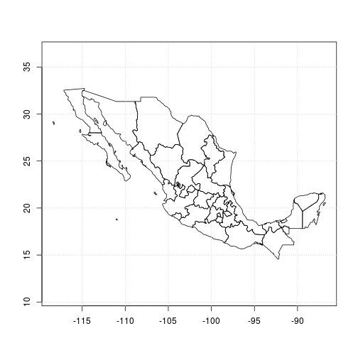
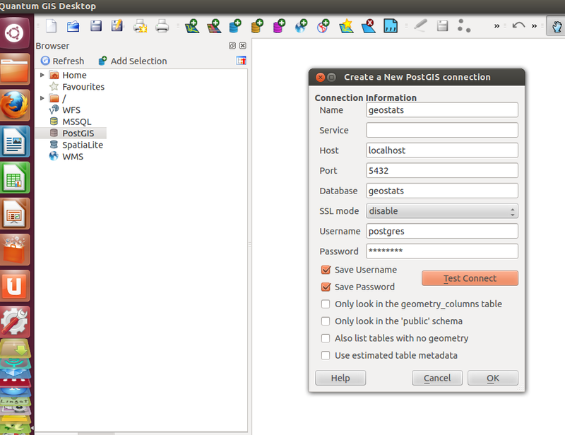
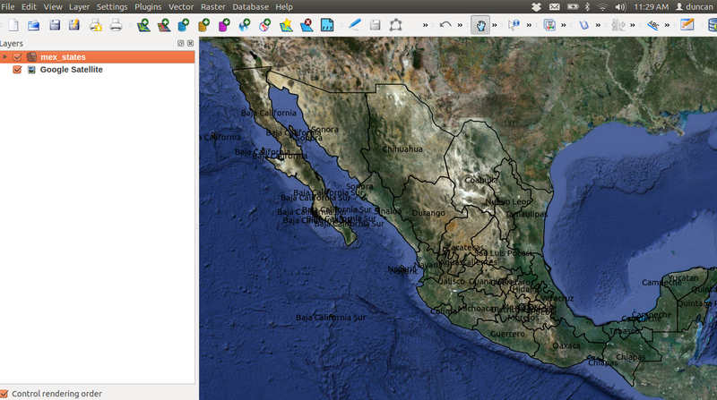
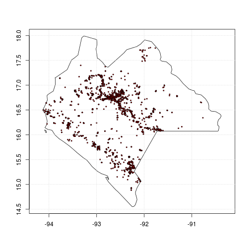
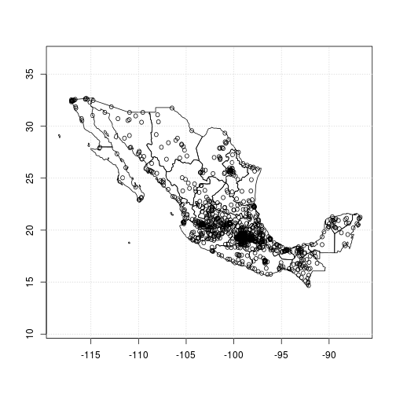
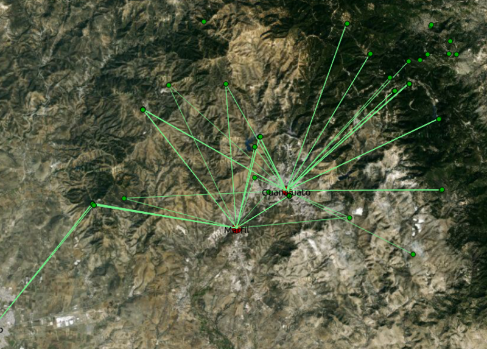
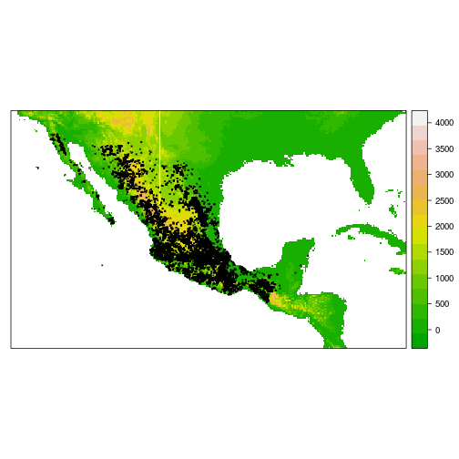
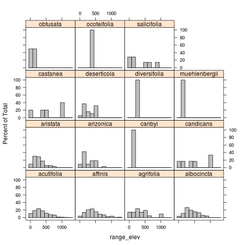
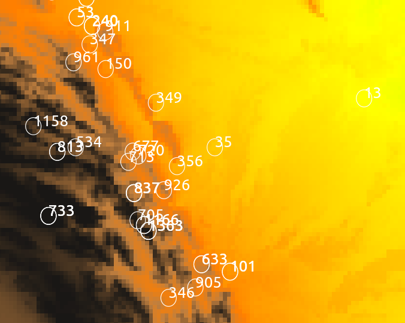
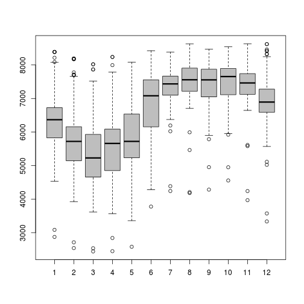

Working with PostGIS from R
========================================================

# Introduction

Spatial data bases are widely used for storing and sharing institutional data. They are often run on a server in order to present spatial data to users on a network or over the internet, often using a mapserver as an intermediate interface. 

PostGIS works by adding a set of spatial operations to Postgresql. These spatial operators give the database the ability to run most of the common desktop GIS operations as SQL queries. So, you can also run PostGIS locally in order to augment both vector and raster processing in R. It is open source and  it is now easy to install under Windows or Linux. 

In order for a local install of PostGIS to be useful as a provider of additional functionality to R there must be a way to transfer data smoothly into and out of PostGIS from R and back.
One way to achieve this is to combine RODBC with rgdal. R is also available as a procedural language (PLR) that can be run directly within the database. It is worth looking at the potential of both approaches as additions to the toolbox of OSGEO functions available for R users. 
These examples have been run on Linux (Ubuntu). While all the code can be adapted to run on Windows quite easily, there are a couple of advantages of running PostGIS on Linux. The first is that it is easy to build from source under Linux. This is useful for raster processing as the code is still under active development and is constantly improving. The second is that it is simple to use system commands from R under linux in order to load data into PostGIS. This can also be achieved under Windows, but it is rather more complicated.

PostGIS can be set up very easily on Windows by adding the extension during the postgresql install procedure.

http://www.postgresql.org/download/windows/

If you want to follow the example of vector processing from Windows you may need to load layers using QGIS. The code for raster processing would not run "out of the box" on Windows, but could be adapted quite easily.

## Installing PostGIS under Ubuntu


Ubuntu is the most popular distribution for laptop users. PostGIS can be setup in just a few minutes by pasting in the lines below. Because there are rather a lot of different potential repositories for open source GIS packages it is possible to run into problems with dependencies if you have already installed GIS packages. You may need to check versions carefully if this does not work.
The following instructions were tested on tuesday 28 May 2013 on a fresh install of Ubuntu 12.04 Precise.
The simplest way of installing is simply to download the binary packages with their dependencies. 

### Installing from binaries

First install Postgresql. The default repository version at present is postgresql-9.1 (9.2 is now released). Use this version to ensure that all the instructions work.

```
sudo apt-get -y install postgresql postgresql-client postgresql-server-dev-9.1 pgadmin3
```
You will now have the database server running in the background.
Now comes a slightly confusing element. Postgresql is designed to store institutional data, so it has many built in security features. These are not needed for desktop use. In fact they can easily get in the way, particularly if you are relatively new to databases. So running a couple of lines at this point to give you superuser priviledges will prevent problems in the future. 
The default superuser is called 'postgres' After an install a password needs to be set for this user. The OS user also known as postgres also has been added (this is a cause of confusion). Set both these passwords to 'postgres' and also set up yourself up as a super user by  running these lines. 

```
sudo passwd postgres 
```
Type "postgres" after typing your own password.

Now alter the postgres user.

```
sudo -u postgres psql -c "alter user postgres with password 'postgres';"
sudo -u postgres createuser duncan --superuser
```

The program pgadmin provides a powerful graphical interface to postgresql. If you are new to databases there will be a lot to learn, but you may find many other uses for postgreslq in your research. It is an excelent open source replacement for MsAccess. 

Postgresql can now be used, as soon as you have your own PostGIS database. To download a recent binary version of postgis (plus qgis and grass if you don't already have them) run these lines.
```
sudo add-apt-repository ppa:ubuntugis/ubuntugis-unstable
sudo add-apt-repository ppa:sharpie/postgis-nightly
sudo apt-get update

sudo apt-get -y install postgresql-9.1-postgis qgis grass
sudo apt-get -y install odbc-postgresql unixodbc
sudo apt-get install postgresql-9.1-plr
```

That is it. We will setup the first database directly from R in order to show how closely the two can be linked, although this can also be done using pgadmin or the commandline.


### Building PostGIS from source

Because PostGIS raster is still under active development it is well worth installing the latest version of PostGIS if you want to use all the raster features. This is quite easy to do under Ubuntu. The following was also tested with a fresh install of Ubuntu 12.04 precise. Note that this can be run after installing the binaries without issue. In fact installing a binary package first is the easiest way to make sure that the loaders are available.

First load the necessary libraries.

```
sudo apt-get -y install proj.dev libgdal.dev
sudo apt-get install libgdal.dev libproj.dev libxml2-dev libgeos-dev 
sudo apt-get install libarmadillo-dev libpoppler-dev libepsilon-dev libexpat-dev liblzma-dev
```

Now bring down the latest source code, uncompress it, move into the directory and build. The default configuration includes raster functions.

```
wget http://postgis.net/stuff/postgis-2.1.0beta3dev.tar.gz
tar xvzf postgis-2.1*
cd postgis*
./configure
make
sudo make install
```
That should all compile and install using only the default configuration settings.

To build the latest PLR from source. This is probably not necessary if you downloaded the binary.

```
wget https://github.com/jconway/plr/archive/master.zip
unzip master.zip
 cd plr-master
 USE_PGXS=1 make
 sudo USE_PGXS=1 make install
```
## Downloading example data

The following file contains all the data needed to run the examples after setting up PostGIS.
https://dl.dropboxusercontent.com/u/2703650/Courses/geostats/geostats.zip


```
wget https://dl.dropboxusercontent.com/u/2703650/Courses/geostats/geostats.zip
unzip geostats.zip

```
# Using PostGIS from R

### Loading packages 

Two packages are used to link R with PostGIS using the method demonstrated here. RODBC provides Open Data Base Connectivity. This package can be used to connect R to any database, including MySQL and MSAccess.  In effect it allows R to "speak" SQL, providing an appropriate data base connection is established.

The other key package is rgdal. This is used to provide access to a wide range of spatial drivers, including PostGIS. Rgdal is needed in order to import data in shapefile or other formats. It is also useful for importing and exporting spatial objects to PostGIS as will be demonstrated using the fairly simple examples.


```r
setwd("/home/duncan/Dropbox/Public/Courses/geostats")
rm(list = ls())
library(RODBC)
library(rgdal)
```

```
## Loading required package: sp
```

```
## rgdal: version: 0.8-9, (SVN revision 470) Geospatial Data Abstraction
## Library extensions to R successfully loaded Loaded GDAL runtime: GDAL
## 1.9.2, released 2012/10/08 Path to GDAL shared files: /usr/share/gdal/1.9
## Loaded PROJ.4 runtime: Rel. 4.8.0, 6 March 2012, [PJ_VERSION: 480] Path to
## PROJ.4 shared files: (autodetected)
```


### Creating a new data base

A Linux specific trick that can come in very handy is the ability to use system commands without dropping out of R. This can be useful for loading data into PostGIS.

For example, we can create a fresh PostGIS database to hold the example data directly from R.


```r
system("createdb geostats")
```


This is the equivalent of running the following command in a terminal.

```
createdb geostats
```

Under Windows it would be preferable to create a new PostGIS database  using pgadmin. This is not shown here, but it is quite straight forward. A windows ODBC driver for Postgresql is also available and easy to install.

We now have a blank Postgresql database. However it is not yet a PostGIS data base.  

### Establishing an ODBC connection

So, let's set up a connection to this database and send some commands to it from R. We can use the first commands to create the PostGIS extension.

To do this in Ubuntu we need to edit the /etc/odbc.ini file.

```
sudo gedit /etc/odbc.ini
```
If your example database is called "geostats" just paste the following text into this file and save it. 

```
[geostats]
Driver = /usr/lib/i386-linux-gnu/odbc/psqlodbcw.so
Database = geostats
Servername = localhost
Username = postgres
Password = postgres
Protocol = 8.2.5
ReadOnly = 0
```
Now we can establish a connection to the database using the named dns.


```r
con <- odbcConnect("geostats")
```


Queries that do not return data can be run from R using odbcQuery.


```r
odbcQuery(con, "CREATE EXTENSION POSTGIS")
```

```
## [1] 1
```

```r
odbcQuery(con, "CREATE EXTENSION PLR")
```

```
## [1] 1
```


If the queries return "1" they have been run successfully. Failed queries return -1. There is no way of getting diagnistic information in R. It is therefore a good idea to test more complex queries first using PgAdmin.

### Loading vector data into PostGIS from R

Now we can read in some example data. In my case I unzipped it to /home/duncan/geostats. If this is set as the working directory the uncommented line will work. Otherwise write your full path. I am afraid that you will have to rewrite the lines with paths several times in order to run the code, as absolute paths are needed for many operations so I have written in my own path rather than use many paste operations that might have appeared confusing.


```r
# states<-readOGR('/home/duncan/geostats/shapefiles','mex_states')
states <- readOGR("shapefiles", "states")
```

```
## OGR data source with driver: ESRI Shapefile 
## Source: "shapefiles", layer: "states"
## with 51 features and 3 fields
## Feature type: wkbPolygon with 2 dimensions
```

```r
plot(states)
box()
axis(1)
axis(2)
grid()
```

 


Now write the shapefile to PostGIS


```r
writeOGR(states, "PG:dbname=geostats", layer_options = "geometry_name=geom", 
    "states", "PostgreSQL")
```


This will automatically set up a spatial index, which is usually desirable for processing speed.  We will look at more explicit means of loading data later.


### Visualising results in QGIS

Quantum GIS was designed as a visualisation tool for PostGIS. The QGIS browser feature and the database manager make it very easy to move layers from PostGIS onto the canvas. First establish a connection with the database. 



The following figure was produced by simply dragging the layer onto the canvas and dropping it on top of a Google image loaded using the Open Layers plugin.




### Loading point data

Let's now read some point data from a text file.


```r
# towns<-read.csv('/home/duncan/geostats/textfiles/MexTowns.csv')
towns <- read.csv("textfiles/MexTowns.csv")
head(towns)
```

```
##     gid                       placename    pop      x     y
## 1 30669                   Ciudad Madero 197216 -97.83 22.28
## 2 30856                        González  11212 -98.43 22.83
## 3 30908 Estación Manuel (Úrsulo Galván)  12077 -98.32 22.73
## 4 31450       Ciudad Gustavo Díaz Ordaz  11523 -98.60 26.23
## 5 32155                    Ciudad Mante  84787 -98.97 22.74
## 6 32410               Heroica Matamoros 449815 -97.50 25.88
```


To turn this into a spatial object we just need to tell R which columns hold the coordinates and set the CRS. In this case it is the same as the shape file that we loaded (EPSG:4326)


```r
coordinates(towns) <- ~x + y
proj4string(towns) <- proj4string(states)
writeOGR(towns, "PG:dbname=geostats", layer_options = "geometry_name=geom", 
    "towns", "PostgreSQL")
```


Some more data on collections of Mexican Oak species.


```r
# oaks<-read.csv('/home/duncan/geostats/textfiles/MexOaks.csv')
oaks <- read.csv("textfiles/MexOaks.csv")
head(oaks)
```

```
##      gid   genus     species       x     y
## 1 774173 Quercus salicifolia  -99.90 16.87
## 2 774174 Quercus salicifolia  -99.88 16.87
## 3 774175 Quercus salicifolia -102.00 23.00
## 4 774177 Quercus ocoteifolia  -95.15 18.58
## 5 774178 Quercus salicifolia -102.00 23.00
## 6 774179 Quercus salicifolia  -98.20 20.22
```

```r
coordinates(oaks) <- ~x + y
proj4string(oaks) <- proj4string(states)
```


Now send the points to our database. However, the gdal driver runs very slowly when used directly from within R when there are many data records, as is the case for the oaks collection points. So this time we will try running the shapefile loader from the command line. 


```r

writeOGR(oaks, "shapefiles", "oaks", "ESRI Shapefile")
```

```
## Error: layer exists, use a new layer name
```

```r

# com<-'shp2pgsql -s 4326 -I /home/duncan/geostats/shapefiles/oaks.shp
# oaks| psql -d geostats;'
com <- "shp2pgsql -s 4326 -I shapefiles/oaks.shp oaks| psql -d geostats;"
system(com)
```


This line uses the shp2pgsql command. This is well documented and has many possible options including transformation from one CRS to another.

## Using SQL

Suppose we want to extract all the oak species in the State of Chiapas. This is easy to achieve using a spatial overlay in R.


```r

oaks$state <- over(oaks, states)$admin_name
chisoaks <- subset(oaks, state == "Chiapas")
chis <- subset(states, states@data$admin_name == "Chiapas")
plot(chis)
points(chisoaks, pch = 21, bg = 3, cex = 0.4)
box()
axis(1)
axis(2)
grid()
```

 


The same result can be achieved in PostGIS with a spatial query. 


```r
query <- "select genus,species,st_x(o.geom) x,st_y(o.geom) y from oaks o, states s where st_intersects(o.geom,s.geom) and admin_name like 'Chiapas'"
chisoaks <- sqlQuery(con, query)
coordinates(chisoaks) <- ~x + y
plot(chis)
points(chisoaks, pch = 21, bg = 2, cex = 0.4)
box()
axis(1)
axis(2)
grid()
```

 


So there is little difference between the two approaches. Extracting the data using an overlay in R may be simpler and faster, but the sql may be more readable to some people. However there are operations that are not so straight forward in R.

## Buffering

A commmon operation is to find a buffer around points. This is particularly easy in PostGIS. However if you find the PostGIS st_buffer function you might first be tempted to try this in order to construct a 0.2 degree buffer (we will see how to use distance later) around the points.


```r
query <- "select gid,placename,st_buffer(geom,0.2) from towns"
buffer <- sqlQuery(con, query)
```


This would not work as a way of making a spatial object. The query would return a geometry column that R cannot understand directly.


```r
head(buffer)
```

```
##     gid                       placename
## 1 30669                   Ciudad Madero
## 2 30856                        González
## 3 30908 Estación Manuel (Úrsulo Galván)
## 4 31450       Ciudad Gustavo Díaz Ordaz
## 5 32155                    Ciudad Mante
## 6 32410               Heroica Matamoros
##                                                                                                                                                                                                                                                                                                                                                                                                                                                                                                                                                                                                                                                                                                                                                                                                                                                                                                                                                                                                                                                                                                                           st_buffer
## 1 0103000020E610000001000000210000007A35F1AC686858C06FC1166CC146364088D26AA3A76858C0C6309855C43C364042216B1B626958C0E868918329333640D3627AEA906A58C02E77BA734F2A36409502956D286C58C0A9C2723B8D223640B7EFA6FB186E58C0A043082F2F1C364025AC9C7F4F7058C05A3DCBF2731736401D5E1E34B67258C07402CA128A1436404702BE79357558C03C8EE3388E13364071A65DBFB47758C07402CA128A1436406958DF731B7A58C05A3DCBF273173640D714D5F7517C58C0A043082F2F1C3640F801E785427E58C0A9C2723B8D223640BBA10109DA7F58C02E77BA734F2A36404CE310D8088158C0E76891832933364006321150C38158C0C6309855C43C364014CF8A46028258C06FC1166CC146364006321150C38158C018529582BE5036404CE310D8088158C0F6199C54595A3640BBA10109DA7F58C0B00B736433633640F901E785427E58C035C0BA9CF56A3640D714D5F7517C58C03E3F25A9537136406958DF731B7A58C0844562E50E76364071A65DBFB47758C06A8063C5F87836404702BE79357558C0A2F4499FF47936401D5E1E34B67258C06A8063C5F878364025AC9C7F4F7058C0844562E50E763640B7EFA6FB186E58C03F3F25A9537136409602956D286C58C035C0BA9CF56A3640D3627AEA906A58C0B00B73643363364042216B1B626958C0F7199C54595A364088D26AA3A76858C018529582BE5036407A35F1AC686858C06FC1166CC146364
## 2 0103000020E610000001000000210000006FC1166CC18E58C0E661EA72FBD336407D5E9062008F58C03DD16B5CFEC9364037AD90DABA8F58C05F09658A63C03640C8EE9FA9E99058C0A5178E7A89B736408A8EBA2C819258C020634642C7AF3640AC7BCCBA719458C017E4DB3569A936401A38C23EA89658C0D1DD9EF9ADA4364012EA43F30E9958C0EBA29D19C4A136403C8EE3388E9B58C0B32EB73FC8A036406632837E0D9E58C0EBA29D19C4A136405EE4043374A058C0D1DD9EF9ADA43640CCA0FAB6AAA258C017E4DB3569A93640ED8D0C459BA458C020634642C7AF3640B02D27C832A658C0A5178E7A89B73640416F369761A758C05E09658A63C03640FBBD360F1CA858C03DD16B5CFEC93640095BB0055BA858C0E661EA72FBD33640FBBD360F1CA858C08FF26889F8DD3640416F369761A758C06DBA6F5B93E73640B02D27C832A658C027AC466B6DF03640EE8D0C459BA458C0AC608EA32FF83640CCA0FAB6AAA258C0B5DFF8AF8DFE36405EE4043374A058C0FBE535EC480337406632837E0D9E58C0E12037CC320637403C8EE3388E9B58C019951DA62E07374012EA43F30E9958C0E12037CC320637401A38C23EA89658C0FBE535EC48033740AC7BCCBA719458C0B6DFF8AF8DFE36408B8EBA2C819258C0AC608EA32FF83640C8EE9FA9E99058C027AC466B6DF0364037AD90DABA8F58C06EBA6F5B93E736407D5E9062008F58C08FF26889F8DD36406FC1166CC18E58C0E661EA72FBD3364
## 3 0103000020E610000001000000210000001F436587A98758C0AB4FFAA44FBA36402DE0DE7DE88758C002BF7B8E52B03640E72EDFF5A28858C024F774BCB7A636407870EEC4D18958C06A059EACDD9D36403A100948698B58C0E55056741B9636405CFD1AD6598D58C0DCD1EB67BD8F3640CAB9105A908F58C096CBAE2B028B3640C26B920EF79158C0B090AD4B18883640EC0F3254769458C0781CC7711C87364016B4D199F59658C0B090AD4B188836400E66534E5C9958C096CBAE2B028B36407C2249D2929B58C0DCD1EB67BD8F36409D0F5B60839D58C0E55056741B96364060AF75E31A9F58C06A059EACDD9D3640F1F084B249A058C023F774BCB7A63640AB3F852A04A158C002BF7B8E52B03640B9DCFE2043A158C0AB4FFAA44FBA3640AB3F852A04A158C054E078BB4CC43640F1F084B249A058C032A87F8DE7CD364060AF75E31A9F58C0EC99569DC1D636409E0F5B60839D58C0714E9ED583DE36407C2249D2929B58C07ACD08E2E1E436400E66534E5C9958C0C0D3451E9DE9364016B4D199F59658C0A60E47FE86EC3640EC0F3254769458C0DE822DD882ED3640C26B920EF79158C0A60E47FE86EC3640CAB9105A908F58C0C0D3451E9DE936405CFD1AD6598D58C07BCD08E2E1E436403B100948698B58C0714E9ED583DE36407870EEC4D18958C0EC99569DC1D63640E72EDFF5A28858C033A87F8DE7CD36402DE0DE7DE88758C054E078BB4CC436401F436587A98758C0AB4FFAA44FBA364
## 4 0103000020E61000000100000021000000EDCDAB89679958C04BD961EA723B3A40FB6A2580A69958C0A248E3D375313A40B5B925F8609A58C0C480DC01DB273A4046FB34C78F9B58C00A8F05F2001F3A40089B4F4A279D58C085DABDB93E173A402A8861D8179F58C07C5B53ADE0103A409844575C4EA158C036551671250C3A4090F6D810B5A358C0501A15913B093A40BA9A785634A658C018A62EB73F083A40E43E189CB3A858C0501A15913B093A40DCF099501AAB58C036551671250C3A404AAD8FD450AD58C07C5B53ADE0103A406B9AA16241AF58C085DABDB93E173A402E3ABCE5D8B058C00A8F05F2001F3A40BF7BCBB407B258C0C380DC01DB273A4079CACB2CC2B258C0A248E3D375313A408767452301B358C04BD961EA723B3A4079CACB2CC2B258C0F469E00070453A40BF7BCBB407B258C0D231E7D20A4F3A402E3ABCE5D8B058C08C23BEE2E4573A406C9AA16241AF58C011D8051BA75F3A404AAD8FD450AD58C01A57702705663A40DCF099501AAB58C0605DAD63C06A3A40E43E189CB3A858C04698AE43AA6D3A40BA9A785634A658C07E0C951DA66E3A4090F6D810B5A358C04698AE43AA6D3A409844575C4EA158C0605DAD63C06A3A402A8861D8179F58C01B57702705663A40099B4F4A279D58C011D8051BA75F3A4046FB34C78F9B58C08C23BEE2E4573A40B5B925F8609A58C0D331E7D20A4F3A40FB6A2580A69958C0F469E00070453A40EDCDAB89679958C04BD961EA723B3A4
## 5 0103000020E61000000100000021000000156CC1166CB158C0AE47E17A14BE364023093B0DABB158C005B7626417B43640DD573B8565B258C027EF5B927CAA36406E994A5494B358C06DFD8482A2A13640303965D72BB558C0E8483D4AE0993640522677651CB758C0DFC9D23D82933640C0E26CE952B958C099C39501C78E3640B894EE9DB9BB58C0B3889421DD8B3640E2388EE338BE58C07B14AE47E18A36400CDD2D29B8C058C0B3889421DD8B3640048FAFDD1EC358C099C39501C78E3640724BA56155C558C0DFC9D23D829336409338B7EF45C758C0E8483D4AE099364056D8D172DDC858C06DFD8482A2A13640E719E1410CCA58C026EF5B927CAA3640A168E1B9C6CA58C005B7626417B43640AF055BB005CB58C0AE47E17A14BE3640A168E1B9C6CA58C057D85F9111C83640E719E1410CCA58C035A06663ACD1364056D8D172DDC858C0EF913D7386DA36409438B7EF45C758C0744685AB48E23640724BA56155C558C07DC5EFB7A6E83640048FAFDD1EC358C0C3CB2CF461ED36400CDD2D29B8C058C0A9062ED44BF03640E2388EE338BE58C0E17A14AE47F13640B894EE9DB9BB58C0A9062ED44BF03640C0E26CE952B958C0C3CB2CF461ED3640522677651CB758C07EC5EFB7A6E83640313965D72BB558C0744685AB48E236406E994A5494B358C0EF913D7386DA3640DD573B8565B258C036A06663ACD1364023093B0DABB158C057D85F9111C83640156CC1166CB158C0AE47E17A14BE364
## 6 0103000020E610000001000000210000007A777777775358C04002BE7935E139408814F16DB65358C097713F6338D739404263F1E5705458C0B9A938919DCD3940D3A400B59F5558C0FFB76181C3C4394095441B38375758C07A031A4901BD3940B7312DC6275958C07184AF3CA3B6394025EE224A5E5B58C02B7E7200E8B139401DA0A4FEC45D58C045437120FEAE394047444444446058C00DCF8A4602AE394071E8E389C36258C045437120FEAE3940699A653E2A6558C02B7E7200E8B13940D7565BC2606758C07184AF3CA3B63940F8436D50516958C07A031A4901BD3940BBE387D3E86A58C0FFB76181C3C439404C2597A2176C58C0B8A938919DCD39400674971AD26C58C097713F6338D7394014111111116D58C04002BE7935E139400674971AD26C58C0E9923C9032EB39404C2597A2176C58C0C75A4362CDF43940BBE387D3E86A58C0814C1A72A7FD3940F9436D50516958C0060162AA69053A40D7565BC2606758C00F80CCB6C70B3A40699A653E2A6558C0558609F382103A4071E8E389C36258C03BC10AD36C133A4047444444446058C07335F1AC68143A401DA0A4FEC45D58C03BC10AD36C133A4025EE224A5E5B58C0558609F382103A40B7312DC6275958C01080CCB6C70B3A4096441B38375758C0060162AA69053A40D3A400B59F5558C0814C1A72A7FD39404263F1E5705458C0C85A4362CDF439408814F16DB65358C0E9923C9032EB39407A777777775358C04002BE7935E1394
```


A useful way around this is to use the gdal driver to pull in a view.


```r
query <- "create view temp_view as select gid,placename,st_buffer(geom,0.2) from towns"
odbcQuery(con, query)
```

```
## [1] 1
```

```r
buffer <- readOGR("PG:dbname=geostats", "temp_view")
```

```
## OGR data source with driver: PostgreSQL 
## Source: "PG:dbname=geostats", layer: "temp_view"
## with 930 features and 2 fields
## Feature type: wkbPolygon with 2 dimensions
```

```r
query <- "drop view temp_view"
odbcQuery(con, query)
```

```
## [1] 1
```

```r
plot(states)
plot(buffer, add = T)
box()
axis(1)
axis(2)
grid()
```

 


This works by creating a temporary view, which is then read into R using rgdal. You can think of a view as a query waiting to be run. In fact you could make a convenience function like this.


```r
getquery <- function(query) {
    query <- paste("create view temp_view as ", query, sep = "")
    odbcQuery(con, query)
    result <- readOGR("PG:dbname=geostats", "temp_view")
    odbcQuery(con, "drop view temp_view")
    return(result)
}
```


A nice feature of PostGIS is that geometries can be easily coerced to Geography in order to measure distances and areas. So this code will extract 10km buffers.


```r
buffer <- getquery("select gid,placename,st_buffer(geom::geography,10000)::geometry geom from towns")
```

```
## OGR data source with driver: PostgreSQL 
## Source: "PG:dbname=geostats", layer: "temp_view"
## with 930 features and 2 fields
## Feature type: wkbPolygon with 2 dimensions
```

```r
plot(buffer)
box()
axis(1)
axis(2)
grid()
```

 


The buffer could be used as an overlay within R if we were interested in finding all collections within a certain radius of a town. However a much better way to achieve this is to run a query that calculates distances directly.


```r
query <- "select o.gid,genus,species,placename, st_distance(o.geom::geography,t.geom::geography)/1000 distkm from towns t, oaks o where st_dwithin(t.geom,o.geom,0.1)"
d <- sqlQuery(con, query)
head(d)
```

```
##     gid   genus  species     placename distkm
## 1 26633 Quercus oleoides Ciudad Madero  4.784
## 2 26640 Quercus oleoides Ciudad Madero 10.346
## 3 26651 Quercus oleoides Ciudad Madero  5.269
## 4 26657 Quercus oleoides Ciudad Madero  4.784
## 5 26665 Quercus oleoides Ciudad Madero  6.241
## 6 26686 Quercus oleoides Ciudad Madero  4.092
```


This query shows several nice features of PostGIS. Instead of running a series of buffers we can use a single "st_dwithin" clause to narrow down the collections to those within a certain range of the towns. The range is in degrees (for speed). However by coercing the geometry to geography we measure the actual distance in meters. This sort of query is of course possible in R itself using spatial classes but it would be relatively tricky and would involve transforming the CRS in this case.

A slightly more complex query could be used to build a table for visualising the results by producing the shortest lines. This approach can also be used to produce networks. Interestingly PostGIS will measure the shortest edge to edge distance between polygons, which can be extremely useful for connectivity analysis and is particularly difficult to achieve in other ways. This code can be run in PGAdmin to produce a table for loading into QGIS.

```
create table oakstotown as
select o.gid,genus,species,placename, 
st_distance(o.geom::geography,t.geom::geography)/1000 distkm, st_shortestline(o.geom,t.geom) geom
 from towns t, oaks o where st_dwithin(t.geom,o.geom,0.1)
```



The above examples demonstrate that vector processing in PostGIS is quite straight forward. All the conventional GIS vector operations can be implemented directly in spatial SQL, which avoids the need to drop out of R to use a commercial vector GIS such as ArcGIS. Simple queries are quite intuitive and easy to follow, although complex queries can be more difficult to design.

## Raster data in PostGIS

Raster processing is a relatively new feature of PostGIS. There are many potential uses for this functionality for web based data processing. 
The benefits of using PostGIS raster as a tool for desktop data processing within R are not immediately clear, given the existing power and elegance of Robert Hijman's raster package. However there are some situations in which it comes into its own.

### Loading raster layers 

Raster data is usually loaded as tiles. Each tile is spatially indexed. This can allow PostGIS raster to process very large rasters. However there is some overhead involved in data access. Some operations may be rather slow as a result and are sensitive to tile size.


```r
command <- "raster2pgsql -s 4326 -d  -M -R /home/duncan/geostats/elevation.tif -F -t 100x100 elevation|psql -d geostats"
system(command)
```


This command loads 1km x 1km elevation data for Mexico (taken from Worldclim) into 100 x 100 pixel tiles. The command only takes a second or so to run as this is a relatively small raster layer. The -R flag means that the actual data stays outside the database and a reference is loaded. Rather suprisingly this speeds up processing of the data. The full path to the data must be used for this. Visualisation of the data in QGIS (or R) is best achieved using the original file. So the purpose of loading the data is to combine vector and raster operations using SQL statements.


## Simple point overlay

If we wish to derive the elevation of point using a simple point on raster overlay we can run the following query.


```r
query <- "select o.gid,genus,species,st_value(rast,geom) from elevation, oaks o where st_intersects(geom,rast)"
d <- sqlQuery(con, query)
head(d)
```

```
##     gid   genus     species st_value
## 1  6091 Quercus chrysolepis     1129
## 2  6092 Quercus chrysolepis      499
## 3 11145 Quercus      dumosa      256
## 4 11155 Quercus      dumosa      966
## 5 11156 Quercus      dumosa      256
## 6 13177 Quercus engelmannii      582
```


Clearly this can also be achieved directly in in R


```r
library(raster)
# elev<-raster('/home/duncan/geostats/elevation.tif')
elev <- raster("elevation.tif")
library(lattice)
trellis.par.set(regions = list(col = terrain.colors(100)))
pts <- list("sp.points", oaks, pch = 4, col = "black", cex = 0.2)
spplot(elev, sp.layout = list(pts))
```

 

```r
oaks$elevation <- extract(elev, oaks)
head(oaks@data)
```

```
##      gid   genus     species           state elevation
## 1 774173 Quercus salicifolia            <NA>        98
## 2 774174 Quercus salicifolia            <NA>       125
## 3 774175 Quercus salicifolia San Luis Potosi      2065
## 4 774177 Quercus ocoteifolia        Veracruz       726
## 5 774178 Quercus salicifolia San Luis Potosi      2065
## 6 774179 Quercus salicifolia          Puebla      2181
```


However, a common issue when overlaying point data is that coordinates of collection points are often not recorded precisely. So we may want to look at the range of elevations around a collection point in order to understand why some points may have unusual values.  We could do that by overlaying a buffer. This will return all the pixels falling within a certain distance of the point.

If the raster is held in small tiles, an overlay operation such as this will return results from several tiles at once. This does lead to rather complex data aggregation. 
A really nice feature of PostGIS is that R functions can be built within the data base using PLR. These can be used to help process results of queries "on the fly".


So we can build R functions within PostGIS using PLR that will take values of an array of pixels returned by a spatial overlay and return a result. So if we want to remove any NAs and return the range of values this function will work.

```
CREATE OR REPLACE FUNCTION range_elev (float[]) RETURNS float AS '
x<-arg1
x<-as.numeric(as.character(x)) 
x<-na.omit(x) 
max(x)-min(x)' 
LANGUAGE 'plr' STRICT;
```


```r
query <- "CREATE OR REPLACE FUNCTION range_elev (float[]) RETURNS float AS '\nx<-arg1\nx<-as.numeric(as.character(x))\nx<-na.omit(x)\nmax(x)-min(x)'\nLANGUAGE 'plr' STRICT;"
odbcQuery(con, query)
```

```
## [1] 1
```


Now we can run the rather complex looking query below in order to obtain the range in elevation within a certain radius (in degrees) of the collections. Coercing the geometries to geography or transforming the CRS allows the query to measure distance in meters.


```r
query <- "select gid,genus,species,range_elev((st_dumpvalues(st_union(st_clip(rast,geom)))).valarray) from (select gid,species,genus, st_buffer(geom::geography,2000)::geometry geom from oaks limit 1400) o, elevation  where st_intersects(rast,geom) group by gid,genus,species;"
d <- sqlQuery(con, query)
head(d)
```

```
##    gid   genus    species range_elev
## 1  576 Quercus acutifolia        259
## 2 1005 Quercus    affinis        562
## 3 1342 Quercus   aristata        245
## 4  121 Quercus acutifolia        131
## 5 1344 Quercus   aristata        269
## 6  699 Quercus    affinis        192
```

```r
histogram(~range_elev | species, data = d, col = "grey")
```

 





## Space time raster processing

PostGIS raster potentially comes into its own when dealing with long time series of large rasters. While processing speed can be an issue the underlying architecture is well designed to cope with such tasks. PostGIS is designed to be run on a server, so the task can be left to the most powerful processor. A simple trick for research groups on a tight budget is to install PostGIS on a PC with a solid state hard drive. 

One way of handling multitemporal raster data is to take advantage of table inheritance in Postgresql. 

This involves setting up a parent table that can be used directly in queries. At the same time data can be held in smaller tables that inherit the same properties. This makes PostGIS raster very scaleable. 

Here is a fairly simple example that uses two year's worth of monthly Modis NDVI data.


```r
path <- "/home/duncan/modis/"
query <- "create schema modis;"
odbcQuery(con, query)
```

```
## [1] 1
```

```r
query <- "drop table modis.ndvi cascade;"
odbcQuery(con, query)
```

```
## [1] -1
```

```r
query <- "CREATE TABLE modis.ndvi (\nid serial NOT NULL PRIMARY KEY,\nrid         int not null,\nfdate         date not null,\nrast        raster\n);"
odbcQuery(con, query)
```

```
## [1] 1
```


Setting up the subtables and loading the data is slightly tricky, but it can be achieved from R directly by using string operators to extract information from the file names.


```r
fls <- dir(path)
yrs <- substring(fls, 1, 4)
for (i in unique(yrs)) {
    
    query <- paste("create table modis.ndvi_", i, "(CHECK (fdate >= DATE '", 
        i, "-01-01' AND fdate <= DATE '", i, "-12-31' )) inherits (modis.ndvi);", 
        sep = "")
    print(query)
    odbcQuery(con, query)
    subfls <- fls[grep(i, fls)]
    for (f in subfls) {
        f <- paste(path, f, sep = "")
        command <- paste("raster2pgsql -s 4326 -d  -M -R ", f, " -F -t 100x100 temp|psql -d geostats", 
            sep = "")
        print(command)
        system(command)
        query <- "alter table temp add column fdate date; update temp set fdate = substring(filename,1, 10)::date;"
        print(query)
        odbcQuery(con, query)
        query <- paste("insert into modis.ndvi_", i, " (rid,fdate,rast) select rid,fdate,rast from temp;", 
            sep = "")
        print(query)
        odbcQuery(con, query)
    }
    query <- paste("CREATE INDEX modis_ndvi-", i, "_spindex ON modis.ndvi_", 
        i, " using gist(st_convexhull(rast));", sep = "")
    print(query)
    odbcQuery(con, query)
}
```


Now that we have the data loaded we can use the multi-temporal table in much the same way as a table with only one layer. Again we can design an R function for data aggregation. In this case the NDVI data type is 16 bit signed integer, which has a theoretical range of values from -32,768 to +32,768. The documented data range is from -2000 to +10000. What that means in practice is that all negative values can be discounted as being produced by water or no data. Very low positive values (< 1000) are derived from urban areas or totally barren desert. So, to look at NDVI dynamics for vegetated areas we may want to impose a cutoff at around 1000 to ignore water and built up areas (taking the raw 16 bit values).


```r
query <- " CREATE OR REPLACE FUNCTION ndvi_mean (float[]) RETURNS float AS '\nx<-arg1\nx<-x[x>1000]\nx<-na.omit(x)\nmean(x)'\nLANGUAGE 'plr' STRICT;"

odbcQuery(con, query)
```

```
## [1] 1
```


```r
query <- "select gid, extract(month from fdate) mon,extract(year from fdate) yr, ndvi_mean((st_dumpvalues(st_union(ST_Clip(rast,geom, true)))).valarray) from modis.ndvi, (select gid,st_buffer(geom::geography,10000)::geometry geom from oaks where species like 'sego%' limit 100) a where st_intersects(geom,rast) group by gid,fdate;"

d <- sqlQuery(con, query)
d$mon <- as.factor(d$mon)
d$yr <- as.factor(d$yr)
boxplot(ndvi_mean ~ mon, data = d, col = "grey")
```

 

```r

```


We can fit a mixed effects model in R to test the significance of any difference and extract confidence intervals.


```r
# library(lme4) mod1<-lme(ndvi_mean~yr+mon+(1|gid),data=d)
# mod2<-lmer(ndvi_mean~mon+(1|gid),data=d)
library(nlme)
```

```
## Attaching package: 'nlme'
```

```
## The following object is masked from 'package:raster':
## 
## getData
```

```r
mod1 <- lme(ndvi_mean ~ yr + mon, random = ~1 | gid, data = d, method = "ML")
mod2 <- lme(ndvi_mean ~ mon, random = ~1 | gid, data = d, method = "ML")
anova(mod1, mod2)
```

```
##      Model df   AIC   BIC logLik   Test L.Ratio p-value
## mod1     1 15 36947 37033 -18458                       
## mod2     2 14 36997 37078 -18484 1 vs 2   51.96  <.0001
```

```r
intervals(mod1)$fixed
```

```
##               lower    est.  upper
## (Intercept)  6181.2  6325.1 6469.0
## yr2004        105.8   145.0  184.2
## mon2         -707.5  -611.4 -515.3
## mon3        -1129.7 -1033.7 -937.6
## mon4         -952.5  -856.4 -760.3
## mon5         -651.4  -555.3 -459.3
## mon6          303.9   399.9  496.0
## mon7          890.5   986.5 1082.6
## mon8         1024.2  1120.2 1216.3
## mon9          900.5   996.6 1092.7
## mon10         990.5  1086.6 1182.7
## mon11         944.9  1040.9 1137.0
## mon12         441.2   537.3  633.4
## attr(,"label")
## [1] "Fixed effects:"
```


Rainfall in southern Mexico was around 20% higher in 2004 than in 2003, which accounts for the increase in NDVI after taking into account the seasonal pattern. A more rigorous analysis would of course include spatial autocorrelation and would use a longer time series.


```r
odbcClose(con)
system("dropdb geostats")
```

